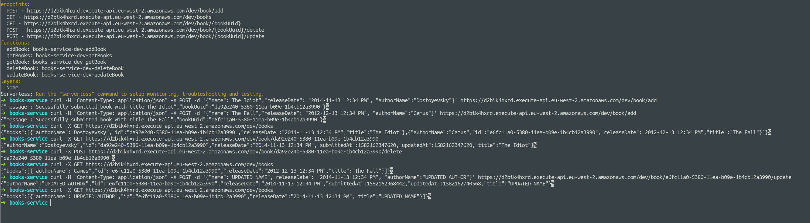

# Serverless DynamoDB AWS Example API

This is an example Books Management API written in Serverless for AWS, using DynamoDB and CloudFormation.

If pushing to AWS, your AWS profile will need access to Lambda and DynamoDB.

## Installation

Clone this repository.

cd into it.

npm install (remove package-lock.json and yarn if you prefer).

sls deploy or run offline.

## Validation

It accepts authorName, name and releaseDate.

authorName (string).

name (string).

releaseDate (timestamp) accepts the following formats:

    "YYYY-MM-DD LT",
    "YYYY-MM-DD h:mm:ss A",
    "YYYY-MM-DD HH:mm:ss",
    "YYYY-MM-DD HH:mm",
    "DD-MM-YYYY LT",
    "DD-MM-YYYY h:mm:ss A",
    "DD-MM-YYYY HH:mm:ss",
    "DD-MM-YYYY HH:mm"
  
## Endpoints

Add a book to the library: POST /book/add

Update book details: POST book/{bookUuid}/update

Delete a book from the library: POST /book/{bookUuid}/delete

Get all books: GET /books

Get book details: GET /book/{bookUuid}

## Example Usage

The following screenshot is an example of the above routes:

